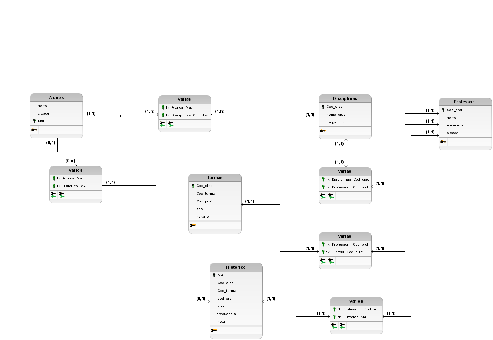

# Modelagem do Banco de Dados
Repositório para modelagem do banco de dados

  

# Descrição das tabelas do modelo

<h2>Tabela <i>Aluno</i></h2>
A tabela <i>aluno</i> descreve dentro no modelo relacional elaborado, onde e quais atributos iremos manter no banco
sobre dos alunos, no banco de dados da Universidade.
Nela possuímos os atributos/colunas:
<ul>
    
MAT : Chave primária da tabela.

    
nome :Nome de cada aluno.

    
cidade: cidade em que o aluno nasceu.

</ul>

<h2>Tabela <i>Disciplinas</i></h2>
A tabela <i>aluno</i> descreve dentro no modelo relacional elaborado, onde e quais atributos iremos manter no banco
sobre as disciplinas, no banco de dados da Universidade.
<ul>
  
cod_disc :Chave primária da tabela.

    
nome_disc : Nome da disciplina.

    
carga_hor : Carga horária das disciplinas.

</ul>

<h2>Tabela <i> Professores</i></h2>
A tabela <i>aluno</i> descreve dentro no modelo relacional elaborado, onde e quais atributos iremos manter no banco
sobre dos professores, no banco de dados da Universidade.
<ul>
  
cod_prof : Chave primária da tabela.

    
nome : Nome do professor

    
endereco : o endereço do professor

    
cidade : cidade em que o professor nasceu.

 </ul>
 
<h2>Tabela <i> varios</i></h2>
A tabela <i>aluno</i> descreve dentro no modelo relacional elaborado, é responsavel por manter de relacionar as tabelas "professores" e  "turma", no banco de dados da Universidade.
<ul>
    
fk_alunos_Mat : Chave estrangeira responsavel por fazer referência a tabela de aluno.

    
fk_Disciplinas_Cod_Disc : Chave estrangeira responsal por fazer referência a tabela disciplina.

</ul>

<h2>Tabela <i>Histórico</i></h2>
A tabela <i>aluno</i> descreve dentro no modelo relacional elaborado, onde e quais atributos iremos manter no banco
sobre dos alunos, no banco de dados da Universidade.
<ul>
    
MAT : Responvesal por fazer referência a matricula do aluno references aluno(MAT).

    
ano : responsavel por armazenar o ano em que o aluno está estudando no momento

    
cod_disc : responsavel por fazer referência a tabela de disciplinas references discplinas(cod_prof).

    
cod_prof : responsavel por fazer referência a tabela de professores references professores(cod_prof).

    
cod_turma : responsal por fazer referência a tabela turma references aluno(cod_turma).

    
frequencia : Responsavel por armazenar a frequencia do aluno

    
nota : Responsavel por armazenar do périodo em que o aluno está na universidade

</ul>
<h2>Tabela <i>Turma</i></h2>
A tabela <i>turma</i> descreve dentro no modelo relacional elaborado, onde e quais atributos iremos manter no banco
sobre dos alunos, no banco de dados da Universidade.
<ul>
    
cod_disc : responsavel por fazer referência a tabela de disciplinas references discplinas(cod_prof).

    
cod_prof : responsavel por fazer referência a tabela de professores references professores(cod_prof).

    
cod_turma : responsal por fazer referência a tabela turma references aluno(cod_turma).

    
frequencia : Frequencia dos alunos

    
horario : Horarios das turmas

</ul>
